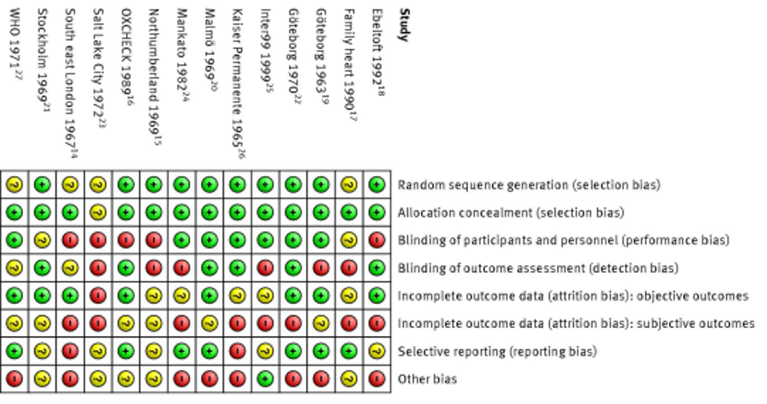
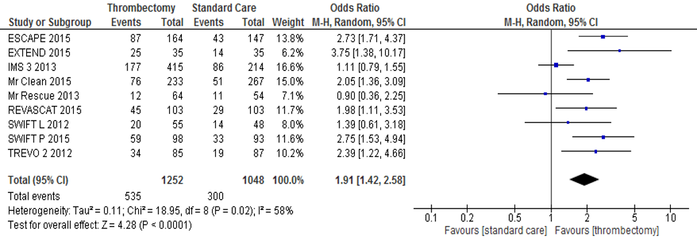
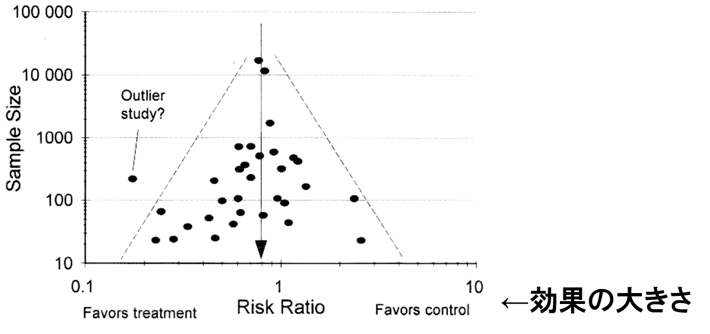

```{r xaringan-themer, include = FALSE}
library(xaringanthemer)
mono_light(
  base_color = "#1c5253",
  header_font_google = google_font("Josefin Sans"),
  # text_font_google   = google_font("M PLUS Rounded 1c", "300", "300i"),
  text_font_google = google_font("Noto Sans JP", "300", "300i"), 
  code_font_google   = google_font("Droid Mono"),
  text_bold_color = "#B03A2E",
  title_slide_background_image = "pic/pylori.jpg"
)
# write_xaringan_theme(text_bold_color = "#FF4333")
```


class: middle
# 目標 <br> objectives

- 系統的レビューの概念を理解する <br> Understand basic ideas of systematic review.

- 臨床疑問を定式化するアプローチを習得する <br> Learn how to formulate an appropriate review question.

- 論文の批判的吟味する <br> How to critically appraise studies?


---
class: middle, center, inverse

# 系統的レビューとは？ <br> What is a systematic review?


---
class: middle


## 系統的 <br> [Systematic](https://eow.alc.co.jp/search?q=systematic)

〔方法や実行が〕体系立てられた、組織的な、手順どおりの

- The manager told his staff to work in a more systematic way. : 支配人はスタッフにもっと系統立った方法で働くように言った。


---
class: middle

## レビュー <br> [Review](https://eow.alc.co.jp/search?q=review)


〔本，作品・公演などを〕批評［論評］する，批判的に吟味する．

<br><br>
--
.center[]


---
class: middle, center, inverse

# Why do we need systematic review? 

---
class: top
background-image: url("./pic/cit_added_FY.gif")
background-position: 50% 90%
background-size: contain

# >1000 new articles/day 

---
class: center, middle
background-image: url("./pic/tmi.gif")
background-size: cover

---
class: middle, inverse, center

# Most research publshed in medical journal is 

--
# too poorly done (全然だめ)

--
# or

--
# insufficiently relevant <br>(不十分)

---
class: middle, center
background-image: url("./pic/ebm_pyramid.gif")
background-size: cover

---
class: middle, center, inverse

# 専門家の意見って何か問題があるの？<br>What's the problem with "expert opinion"?

---
class: middle, center
background-image: url("./pic/experts.png")
background-position: 50% 10%
background-size: cover

---
class: middle, center, inverse
background-image: url("./pic/linuspauling.jpg")
background-position: 50% 50%
background-size: cover


---
class: middle, center 

## Nobel prize winning biochemist [**Linus Pauling**](https://ja.wikipedia.org/wiki/%E3%83%A9%E3%82%A4%E3%83%8A%E3%82%B9%E3%83%BB%E3%83%9D%E3%83%BC%E3%83%AA%E3%83%B3%E3%82%B0) used selective quotes from the medical literature to [**"prove"**](https://www.ncbi.nlm.nih.gov/pmc/articles/PMC431183/?tool=pmcentrez) his theory that

--
# Vitamin C helps you live longer and feel better


---
class: middle, center 

### 後に，[**系統的レビュー**](https://www.ncbi.nlm.nih.gov/pmc/articles/PMC2540847/pdf/bmj00457-0043.pdf)が報告され，<br>数多くの臨床試験のレポートの中に，<br>ビタミンCが風邪を予防できると書いてある<br>論文はわずか**2件**

--
### 残りの59件の文献によると，**ビタミンCの風邪予防効果はほぼプラセボと変わらない．**


---
class: middle 

### 専門家は残念ながら

- 矛盾している意見が多い <br> **conflicting** recommendations

- アドバイスは時代より遅れている <br> their advice frequently **lags behind**

- 最も優れたエビデンスと一致しない場合が多いだろう <br> **inconsistent** with the best available evidence.


---
class: middle

## 系統的レビューで行うこと

ある臨床疑問に対して，**今まで**わかる**すべての証拠**を

- 見つける <br> locate 

- 評価する <br> evaluate

- 統合する <br> synthesize


---
class: middle 

## 系統的レビューの特徴

- 文献を探す戦略/手順は**系統的，包括的** <br> **systematic and comprehensive** (in its identification of literature)

- 答えたい臨床疑問，使う文献資料，及び評価する・統合する手法は**明確でかつはっきりしたもの** <br> explicit in objectives, materials, and methods.

- **再現**できる <br> **reproducible**

- バイアスを**最小限**にする <br> **minimize bias**

- **信頼できる**結論・エビデンスを提供する <br> provide **reliable** evidence/conclusions


---
class: center

## どんな人でも，ステップをフォローすれば同じところまで行ける

### Follow the steps, <br> everyone can have the same results. 

--


---
class: center, middle

# The Cochrane Collaboration

### [www.cochrane.org](https://www.cochrane.org/)


???
International non-profit organisation that prepares, maintains, and disseminates systematic up-to-date reviews of health care interventions.

---
class:  middle

## [Archibald Cochrane (1909–1988): the father of evidence-based medicine](https://academic.oup.com/icvts/article/18/1/121/674823)

.center[]


> “It is surely a great criticism of our profession that we have not organised a **critical summary, by speciality and subspeciality**, adapted **periodically**, of all randomised controlled trials”. 

> -- (Cochrane 1979)


---
class: middle, inverse, center

# 臨床疑問の定式化 <br> Ask an answerable question

--
.center[]


---
class: middle, center

## To assess the effects of 
## [**XX Intervention or comparison**]
## for 
## [**XX health problem**] 
## in 
## [**XX types of people**]

---
class: middle, 

### 比較試験 -- **PICO** <br> controlled trials


1. The **P**opulation/**P**articipant <br> Who are the relevant patients?

22. The **I**ntervention <br> What is the exposure that you are interested in (drug, food, surgery, chemical)?

3. The **C**omparator or **C**ontrol <br> What is the control or althernative exposure that you want to compare with the one you are interested in?

4. The **O**utcome <br> What are the patient-relevant consequences of the exposure?


---
class: middle, center, inverse

## 急性心筋梗塞の患者において，アスピリンは生存率を上げるか？<br>Does aspirin improve survival after acute mycardial infarction?

???
この質問は答える質問だと思いますか？

---
class: middle, inverse

### (P)急性心筋梗塞の患者に，<br> (I)毎日一回アスピリンを投与することは <br> (C)毎日一回プラセボを投与すると比べ，<br> (O)5年間の生存率は高くなるか？


---
class: middle

### 公衆衛生的な質問 -- **SPICE** <br> questions about public health interventions

1. **S**etting:  What is the context of the question? <br> (e.g. European countries, low-middle income countries, Japan, etc.)

2. **P**erspective: Who are the (potential) users of the outcomes?<br> (e.g. pregnant women, new-born babies, middle school students, etc.)

2. **I**ntervention: What is the intervention to them?<br> (e.g. maternal handbook，screen and treatment of _H. pylori_, etc.)

2. **C**omparison <br> What are the alternatives? (e.g. control groups without maternal handbook, or screen and treatment of _H. pylori_, etc.)

3. **E**valuation <br> How to measure if the intervention is successful? (e.g. mortality rate of infants, vaccine rate of babies, gastric cancer in 10-20 years)


---
class: middle, center, inverse

## 若者での喫煙をどうすれば防げる？<br> What is the best strategy to prevent smoking in young people/adolescents?

???
この質問は答える質問だと思いますか？


---
class: middle, center, inverse

## Are mass media (or school-based or community-based) interventions effective in preventing smoking/lowering the prevalence of smokers in young people/adolescents in Japan?

???
Setting: in Japan

Perspective: young people 

Intervention: mass media (or school-based or community-based) interventions

Comparison: without the interventions

Evaluation: smokers proportion

---
class: middle

### 関連する研究をすべて含む

- 疑問に解答可能なエビデンスをすべて網羅する検索法：

	- 電子検索(PubMed, EMbase, Cochrane library)
	- 引用文献の検索(孫引き)
	- ハンドサーチ
	- 著者への問い合わせ

- 検索方法を明記すること

	- 除外基準
	
	- 2人以上が独立に検索し，同じ論文・研究を特定できるまで示す 
	
- 出版バイアスの分析

---
class: middle

### 選んだ論文の批判的吟味する

- 検索で選んだ論文の質をチェックすべき
	- RCT(randomized controlled trial)のチェックポイントを使う
	
.center[]

---
class: middle

### 研究結果の一貫性があるか

- Forest plotを使うことが多い
	- 推定値が同じ方向にあるか
	- 95%信頼区間が重なるか
	
.center[]


---
class: middle

### 出版バイアス

- 研究の規模（被験者数）と有効性（効果の大きさ）を使う
	- 規模の小さい研究では，偶然大きな有効性が出やすい
	
.center[]

---
class: middle 

### 臨床シナリオ

- あなたの父親が働く会社の健康保健組合では，40歳以上の家族なら無料で健康診断を受けられる．しかし，母親は健康診断は意味ないとしてずっと受けずにきた．

- しかし，最近芸能人やスポーツ選手でも立て続けに癌になったり，死亡したケースもあったので，心配になった母親は医学部で学ぶあなたに，健康診断を受けたほうがいいのかを尋ねた．

- あなたは，今日の実習を受けて，健康診断の有効性について系統的レビューの論文を探すことにした．


---
class: middle

### 臨床疑問を定式化

- これは健康診断の有効性についての疑問である．

--
	- (P)健常成人が，

--
	- (I)健康診断を受けると，

--

	- (C)健康診断を受けない場合に比べて，

--

	- (O)どれぐらい死亡率・罹患率が減るか？


---
class: middle 

### エビデンスの検索

- 健康診断のキーワード: health check, medical examination, medical checkup

- 死亡・罹患率のキーワード：mortality, morbidity

---
class: top, inverse
background-image: url("./pic/clinicalq.png")
background-position: 60% 50%
background-size: cover


---
class: top, inverse
background-image: url("./pic/healthcheck.png")
background-position: 20% 50%
background-size: cover


---
class: top, inverse
background-image: url("./pic/healthcheckcochrane.png")
background-position: 20% 50%
background-size: cover

---
class: top, inverse
background-image: url("./pic/cochranReview.png")
background-position: 20% 5%
background-size: cover


---
class: middle, inverse, center

# AUTHORS' CONCLUSIONS: 

--
## Systematic offers of health checks are unlikely to be beneficial and may lead to unnecessary tests and treatments.


---
class: middle, inverse, center 

# Questions?


